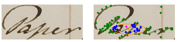
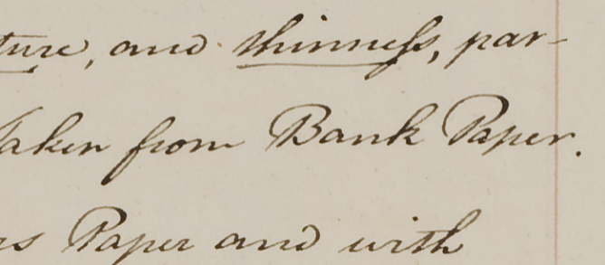
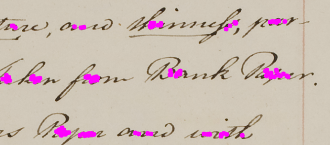
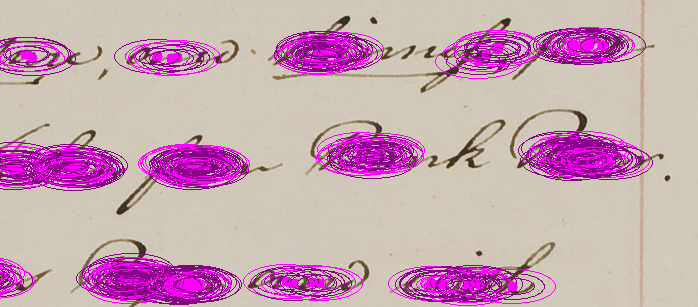
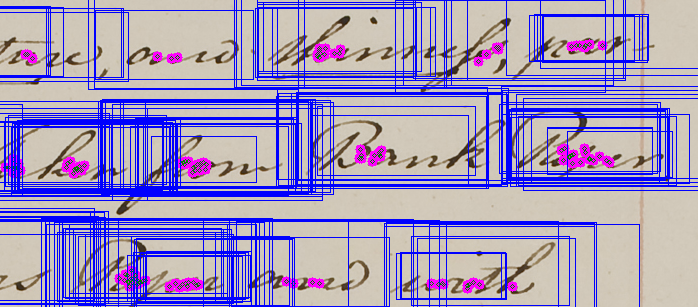
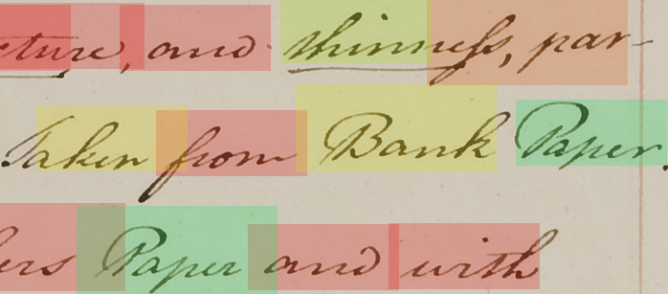

# Word Spotting by Example

## Visual Computing Group (VCG) 
## Democritus University of Thrace (DUTH)

Our algorithm relies on Document-oriented Local Features (DoLF) [Zagoris2017, Zagoris2014] which take into account information around representative keypoints as well a matching process that incorporates spatial context in a local proximity search without using any training data. Finally, it introduces a distance algorithm that incorporates spatial context and is employed under both segmentation-based and segmentation-free scenarios.


The main novelties of the above approach are:

1. Use of local features that takes in consideration the handwritten documents particularities. Therefore, it is able to detect meaningful points of the characters that reside in the documents independently of its scaling. 
2. It provides consistency between different handwritten writing variations.
3. Use of the same operational pipeline in both segmentation-based and segmentation-free scenarios
4. Incorporation of spatial context in the local search of the matching process.

The segmentation - free operational pipeline:


 | 
----------------------|-----------------------------
the query image, the localpoints, the central location (shown in magenta colour) and its nearest keypoint  (shown in orange colour) | the document image
 | 
the candidate local points for the document coordinate origin | multiple instances of word boundaries around each candidate coordinate origin
 | 
multiple word detection | final result (the green colour denotes the most similar word)


Finally, an implementation of the proposed keyword spotting method as a recommender system to a transcription process is available at http://vc.ee.duth.gr/ws [Zagoris2015].

## Usage

```
WordSpottingByExample 1.0.0.0


  indexing     Indexing Directory

  retrieval    Retrieve Word

  help         Display more information on a specific command.

  version      Display version information.
```

### Indexing Verb Usage:
```shell
WordSpottingByExample 1.0.0.0
USAGE:
Indexing example:
  WordSpottingByExample indexing --imageformat jpg C:\WordImages .\dataset.sqlite

  -i, --imageformat                      (Default: png) Image Extension

  --help                                 Display this help screen.

  --version                              Display version information.

  ImagesDirectory (pos. 0)               Required. The directory path that contains the document images for indexing

  Output SQLite Dataset File (pos. 1)    Required. The output SQLite file that contains the dataset info
```
### Retrieval Verb Usage:

```
WordSpottingByExample 1.0.0.0
USAGE:
Locate a word:
  WordSpottingByExample retrieval .\query-word.png .\dataset.sqlite Results.xml

  -i, --imageformat          (Default: png) Image Extension

  --help                     Display this help screen.

  --version                  Display version information.

  QueryImagePath (pos. 0)    Required. The query word image path. It must be a directory or a file

  Dataset (pos. 1)           Required. The SQLite database file

  Results (pos. 2)           Required. The XML Retrieval Results File. It follows the H-KWS2014 XML Format. Download
                             Evaluation Tool from https://vc.ee.duth.gr/H-KWS2014/#VCGEval
```

## References

[Zagoris2014] K. Zagoris, I. Pratikakis and B. Gatos, "Segmentation-Based Historical Hand-written Word Spotting Using Document-Specific Local Features," 2014 14th In-ternational Conference on Frontiers in Handwriting Recognition, Heraklion, 2014, pp. 9-14.

[Zagoris2015] K. Zagoris, I. Pratikakis, and B. Gatos, “A framework for efficient transcription of historical documents using keyword spotting,” in Historical Document Imaging and Processing (HIP’15), 3rd International Workshop on, August 2015, pp. 9–14.

[Zagoris2017] K. Zagoris, I. Pratikakis, B. Gatos. 2017 Unsupervised Word Spotting in Histori-cal Handwritten Document Images using Document-oriented Local Features. Transactions on Image Processing. Under Review. 
